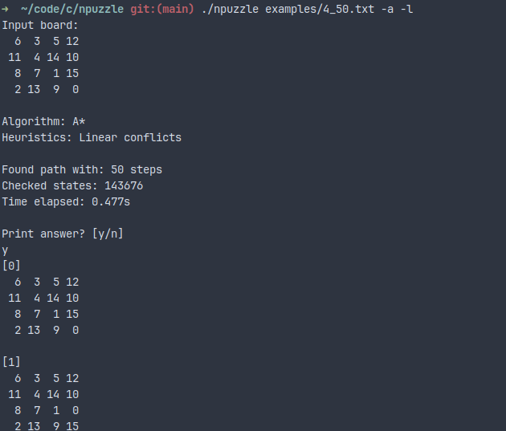

# Npuzzle solver

## Usage

```
USAGE:
    npuzzle FILE [options]

    Default options are --greedy --linear

ARGS:
    FILE
        File with input board.

OPTIONS:
    -g, --greedy
        Use greedy best first search algorithm.

    -a, --astar
        Use A* algorithm.

    -i, --idastar
        Use IDA* algorithm

    -h, --hamming
        Use hamming distance heuristics.

    -m, --manhattan
        Use manhattan distance heuristics.

    -l, --linear
        Use linear conflicts heuristics.

        --help
        Print this help message.
```

## Installation

```
git clone https://github.com/markbragin/npuzzle.git
cd npuzzle
make release
```

then run

`./npuzzle examples/3_31.txt -a -l`

## Examples



## Algorithms

- **Greedy best first search**. Fast but finds not optimal solution.
- **A***. Slow and memory consuming but finds optimal solution.
- **IDA***. Slower than A* but consumes less memory and finds optimal solution.

## Heuristics

- Hamming distance
- Manhattan distance
- Linear conflicts

## Limitations

- Allowed boards not bigger than 16x16. (I don't think one needs more :D).
- Solves only puzzles with the blank tile in the right bottom corner in the
goal state.
- Uses not the most optimal algorithms, so finding optimal path to the hardest
4x4 puzzles takes a lot of time and memory :(.
